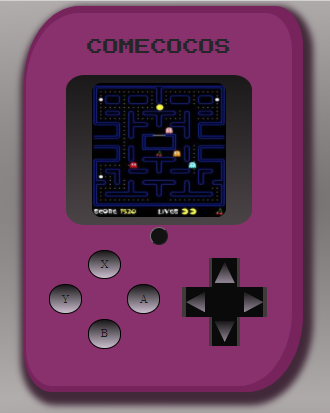

# Consola ComeCocos
Carcasa consola comecocos creada con HTML y CSS3. Dispone de una función realizada con JavaScript en la que pinchando el botón central de la consola cambia la imagen central por una pantalla negra, simulando botón on/off de una consola real.

También dispone de un efecto de transicion en la pantalla central que al posicionarte con el ratón cambia la imagen simulando movimiento en los comecocos de la pantalla central.

